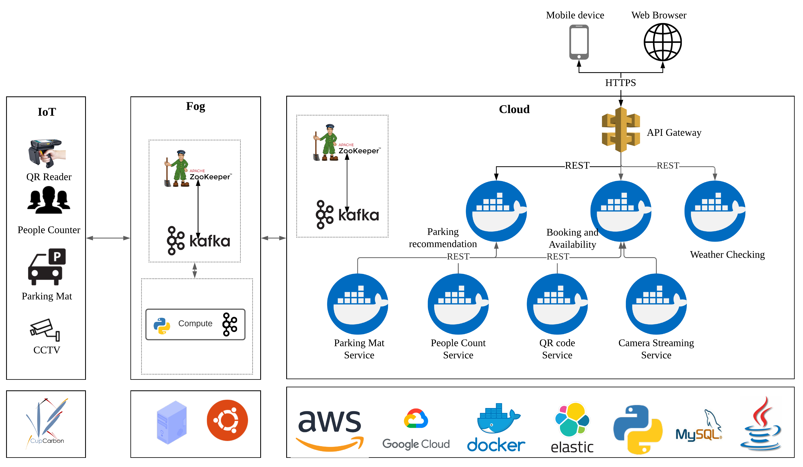
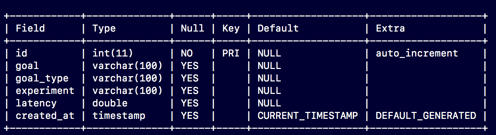

# MiLA4U

The implementation details and result replication for MiLA4U approach are presensented below:


## Experiment Setup and System Configurations

The system consists of sensors deployed on the edge, lightweight computation distributed to a Fog and microservices deployed on the cloud. 

#### Microservice deployment Configurations

The microservices were deployed on two Google Cloud instances with different geographical zones.The first one was run on a N1-Standard-4 CPU Intel Haswell Processor comprising 4 vCPU and 16 GB RAM with US-Central-1a as the geographical zone and Ubuntu 20.04 LTS. The second one ran on a N2-Standard-4 Intel Skylake processor comprising 2 vCPU and 8 GB RAM with US-Central-1c as the geographical zone and Ubuntu 18.04 LTS.

#### Fog and IoT deployment Configurations

To emulate the edge layer setup, one desktop machine with 8 GB RAM and Intel 3rd Generation i5 (2.6 GHz quad core) with Ubuntu 16.04 LTS was used to run the CupCarbon simulation. Further, a Macbook pro with 16GB RAM and 8th Generation Intel i7 1.7 GHz (Quad Core) was used to deploy the Fog layer. The configurations of different IoT sensors can be found [here](https://github.com/karthikv1392/PIE-ML/wiki)


## NdR Case Study Application Architecture




## MiLA4U Framework

#### Installation Requirements

1. Docker - https://docs.docker.com/get-docker/
2. Elasticsearch - https://www.elastic.co/downloads/elasticsearch?latest
3. MySQL - https://dev.mysql.com/doc/mysql-installation-excerpt/8.0/en/windows-install-archive.html
4. Python 3.7+ - https://www.python.org/downloads/
5. Java (JDK >= 8.0) - https://www.java.com/en/download/
6. Apache Kafka - https://kafka.apache.org/quickstart


## Python Package requirements

1. asyncio
2. kafka-python
3. elasticsearch
4. mysql-connector-python
5. matplotlib
6. numpy
7. pandas
8. tornado >= 6.0

## Instructions 

Listed below are the steps in which the implementation needs to be replicated. All the python files, except class files needs to be executed as

```shell
python <filename>.py
```

The complete experiment was executed for a period of 18000 seconds

### Microservice Layer (Running Microservices in Docker Containers):

Each folder with "_service_" in the name essentially is a microservice. To run the service move into the directory using a _cd_ command and execute the following:


```shell
sudo docker build  -t image_name .
sudo docker run -e PORT_NUM=port ES_HOST=localhost -it --name image -p port:port image_name
```

The ES_HOST in the previous statement is an argument to specify the IP of the elasticsearch instance and port denotes the port where the webservice listens to. To run multiple instances of the same microservices, simply keep running them in different ports by changing the values for port argument

### Edge and Fog Layer

The edge layer has been simulated using CupCarbon Simulator. All edge related implementation can be found in the folder IoT_Simulation_Adaptation. Open the folder and follow the below steps:

1. CupCarbon-master_4.0 contains the modified source code of cupcarbon. The application can be started by running cupcarbon.java. Inside the source folder (src), go to  senscript_functions/Functions.java, add the path for "config.txt" in line 209
2. Run the CupCarbon from the modified source code (First import the CupCarbon-Master_4.0 as an eclipse project, Same can be done if you are uisng IntelliJ IDE)
3. NdR_Case contains the cupCarbon project of the case study mentioned in the paper. It can be opened by opening the NdR.cup filefrom the open project option available in the cupCarbon UI. Further details can be found in www.cupcarbon.com The natevents folder contains the sensor datasets used which was generated based on real observations of the case study which followed a poisson distribution.
4. *adaptation_handler.py* contains the source code for handling adaptations at the edge layer.It can be run in a dedicated Fog layer. It is a kafka consumer that keeps listening to a topic *sensor*. It further uses *Adapter_IoT.py* for executing the adaptations. The thresholds for arrival rate of microservices and energy consumption are defined inside in this file.
5. Open the NdR_Case project from the open project option in cupCarbon UI
6. Set the simulation parameters in cupCabron to five hours (18000 s), mark the result field for 60s and run the Simulation
7. Immidiately run the programs *CupCarbon_Energy_Streamer.py* and *adaptation_handler.py*

### Application Infrastructure Layer [Cloud Layer]

The scripts for deploying the applicaiton infrastructure layer can be found inside the folder *Application_Layer**

1. *Goal_Parser.py* implements a python class for parsing user goals that are sent as REST request from the users. These will be based on the goal model as defined in the paper. The responsibility of the Parser is to parse the goals to understand the required functionalities.
2. *service_manager.py* is a tornado web service. It contains algorithm for service selection which uses the ranking from adaptation infrastructure layer. Update "localhost" to the ip address of the respective microservices.
3. *service_discovery/app.py* is another tornado based web service. It supports east-west service discovery among microservice based on ranking from adaptation infrastructure layer for discovering microservices.


### User Goal Request Simulation

All the user related script can be found inside the folder *user_simulation* This is used for simulating the user goal requests
The goals can be found in the file *main_user_goal_file.txt*

1. *async_test.py* can be run to simulate the user requests to NdR application that uses dynamic goals. 
2. *static_application_simulator.py* can be run to simulate user requests to NdR application with predefind static flow

**Note:** In both the above scripts, update the "localhost" to ip address of the corresponding servers where microservices are hosted


### Management Infrastructure Layer

For management infrastructure layer, we used a docker monitoring tool available from: https://github.com/stefanprodan/dockprom. It mainly uses a combination of cAdvisor, Prometheus and Grafana for monitoring and visualization of docker containers


### Adaptation Infrastructure Layer

All the scripts realted to this layer can be found inside the folder *Adaptation_Infrastructure* 

1. *ES_Manager.py* is a utility code to interact with Elasticsearch backend. The localhost can be replaced with the IP of your elasticsearch instance.
2. *QoS_Analyzer_Decision_Maker.py* implements the QoS Analyzer and Decision Maker algorithm. Replace "localhost1" and "localhost2" with ip address of the respective VM instances in which the microservices are deployed. The script uses three main configurations defined by variable "adaptation_type" (line 18) i) Executing with adaptation_type = "reactive" is for executing the system with approach "DA"; ii) adaptation_type = "static" is for executing the system with approach "SA" and iii) adaptation_type = "naive" is for executing the system with approach "DN". The script can be executed using 


**Note**: This layer is not executed for *SN* approach


### Results Replication

The scripts for replicating the results can be found inside the folder *Plot_Generation*

1. The mysql file containing the results of the experiment (*user_goals_rt_experiment.csv*) can be found inside *Plot_Generation/. Import this csv file into a mysql table, *user_goal_response_time"*. This table has the following schema



2. *iot_energy* contains the energy consumed by different approaches for a time period of 18000 seconds
3. *plots/result_plots* contains the generated plots which have been presented in the paper
4. Execute *plot_generator.py* to replicate the results of the experiment after completing the above steps


